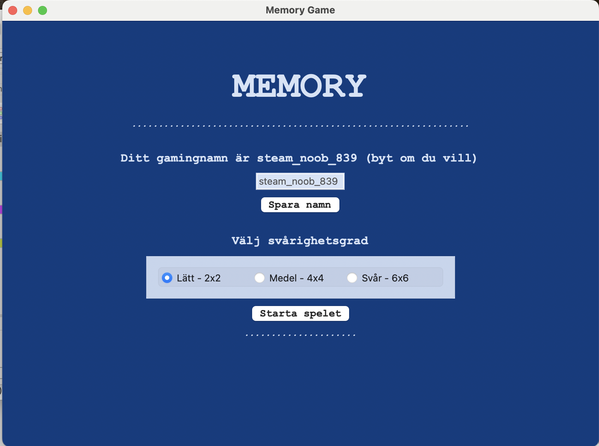
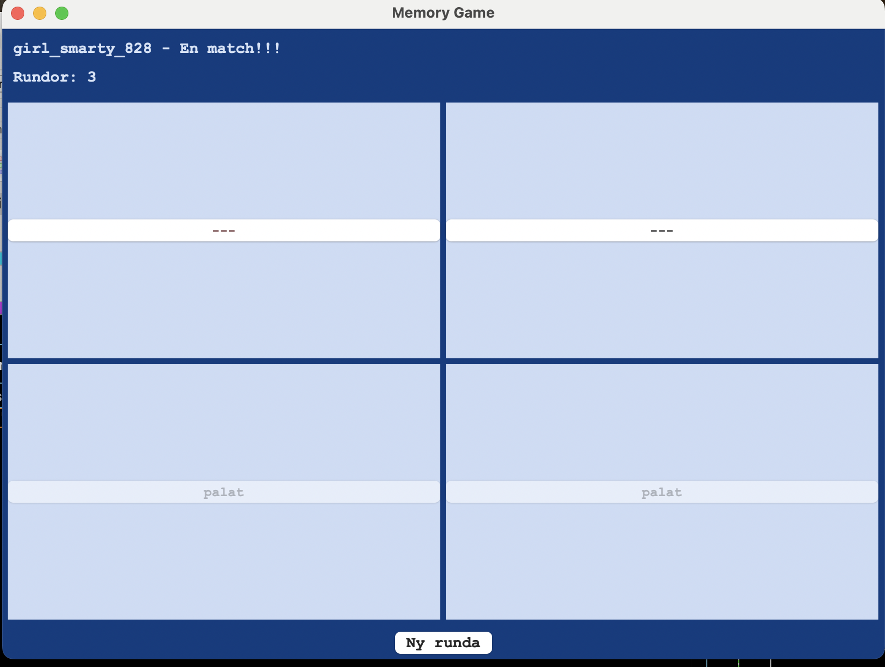
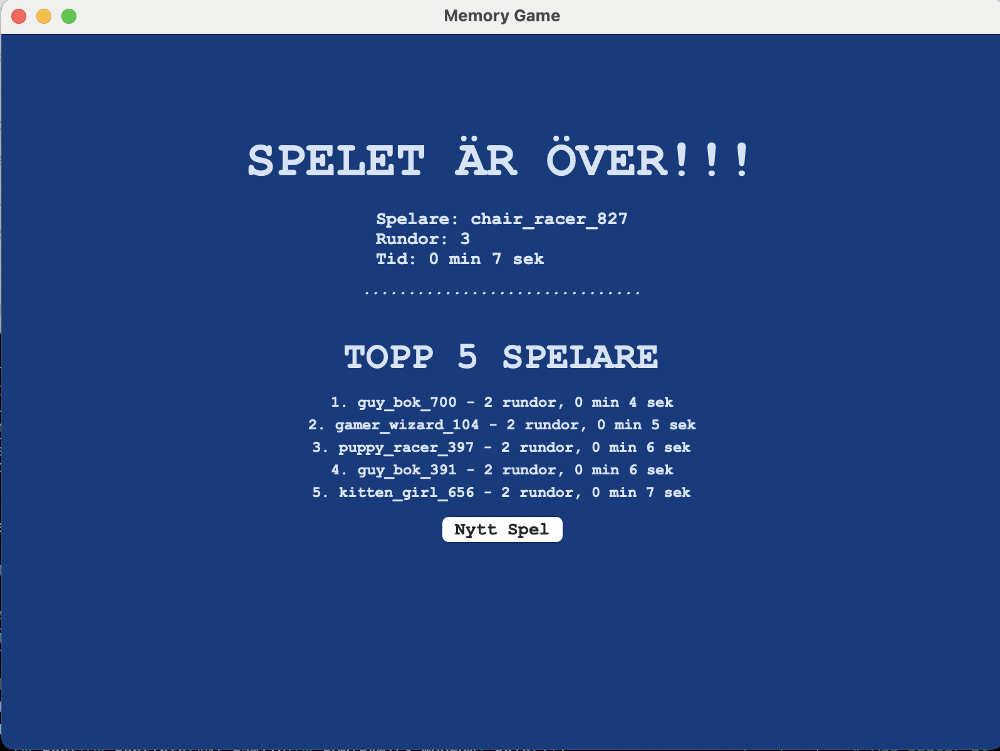

# Memory Game

A description of [Memorygame](https://github.com/AnnaBjrk/memory_game).
This is a Memory game developed as part of a Python course at KTH.
It is basically coded entirely without AI assistance. The part where an AI contributed a little is in the development of the wxPython variant. Tkinter turned out to be not particularly compatible with Mac, so to create a nicer interface, the wxPython version was made afterwards, which has more colors among other things.

The game is made in Python and wxPython.
There is also a Tkinter version - but unfortunately Tkinter is not so compatible with Mac - so the result was a bit lacking. With wxPython, some colors and styling were added.

## Contents

- [Installation](#installation)
- [Usage](#usage)
- [License](#license)

## Installation

To run the program in the terminal, you need to download:
memory_logic.py
memo_words.txt

If you want to run with a GUI, you need an additional file:
Tkinter:
mainGUI.py

wxPython: (recommended)
mainGUI_wx.py

## Usage

A Memory game with 3 difficulty levels:
Easy: 2x2 tiles
Medium: 4x4 tiles
Hard: 6x6 tiles

Images from the game:

## License

The program is free to use, but please refer to #https://github.com/AnnaBjrk
---

For more information, visit [website](https://jib.ny) or contact us at <anna@jib.nu>.